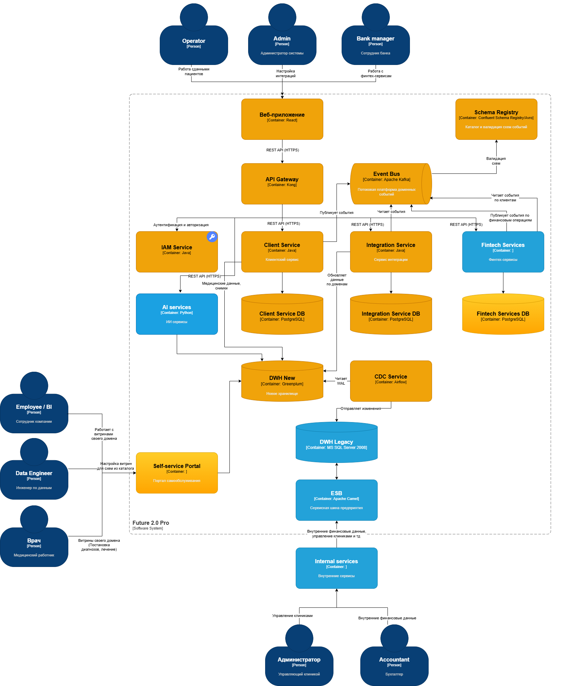
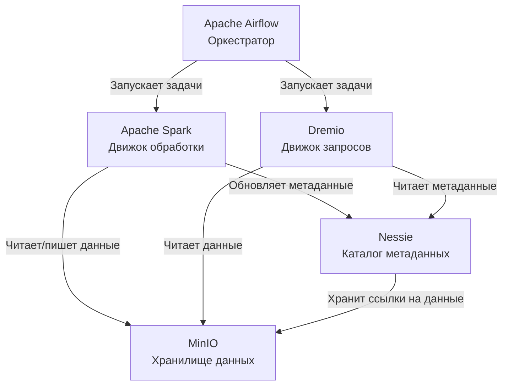

## Задание 1. Проектирование целевой архитектуры и приоритизация проблем для поддержки ключевых бизнес-сценариев компании

Основная проблема это множество данных в одном DWH.  
Предлагается для решения этой проблемы использовать подход Data Mesh с разделением данных по доменам - финтех, ИИ, медицинские данные, внутренние данные для работы клиники и т.д.  
Для этого подхода потребуется внедрение Data Catalog, для федеративного управления.

## Объект проектирования

В текущей модели компании «Будущее 2.0» хранилище данных (DWH) выполняет избыточное количество функций: в нём сконцентрированы разнородные массивы информации, часть бизнес-логики и построение всей отчётности. Это приводит к длительным срокам формирования отчётов и осложняет запуск новых продуктов — каждое новое направление требует вмешательства в сложившуюся структуру.

Моё предложение на горизонте года — перейти к архитектуре, в которой клиники, финтех, ИИ-решения и партнёрские сервисы выделены в самостоятельные предметные домены. Прежнее хранилище при этом сохраняется, но его роль ограничивается хранением исторических данных и обслуживанием сценариев переходного этапа, а также некоторых внутренних сервисов. Всю новую функциональность целесообразно разрабатывать внутри доменов, а для целей аналитики предусмотреть специализированное хранилище и единый портал для работы с отчётами.
Считаем, что исходная BI-система была переведена первой на новый портал отчётности и новый DWH.

## Схема архитектуры

Диаграмма С4: 

Исходный код диаграммы: [task1_c4.drawio](task1_c4.drawio).

## Состав основных контейнеров

| Контейнер               | Назначение                                                                                                  |
|-------------------------|-------------------------------------------------------------------------------------------------------------|
| Портал отчётности       | Обеспечивает сотрудникам возможность самостоятельно формировать несложные отчёты в пределах их полномочий.  |
| IAM                     | SSO/Keycloak: аутентификация/авторизация на уровне всей системы                                             |
| API Gateway             | Kong: единая точка входа, маршрутизация между сервисами                                                     |
| Event Bus               | Kafka: брокер сообщений для потоков доменных событий                                                        |
| Каталог данных          | Даёт прозрачное представление о доступных наборах данных и регламентах доступа к ним.                       |
| Аналитическое хранилище | Выделенная среда для построения отчётности, не создающая дополнительной нагрузки на прежний DWH.            |
| Интеграционный слой     | Выступает в роли посредника при обмене информацией между доменами.                                          |
| Домен «Клиники»         | Охватывает все процессы, связанные с деятельностью медицинских учреждений.                                  |
| Домен «Финтех»          | Включает расчётные счета, кредитные продукты, платёжные операции и прочие финансовые сервисы.               |
| Домен «ИИ»              | Содержит сервисы искусственного интеллекта для обработки медицинской информации.                            |
| Партнёрские домены      | Обеспечивают взаимодействие с фармацевтическими компаниями и поставщиками оборудования.                     |
| Data Lakehouse          | Обслуживает потоки данных для новых доменов, предоставляет данные для аналитики и портала самообслуживания. | 
| Legacy DWH              | Хранит исторические данные и поддерживает старые сценарии в переходный период.                              |
| Internal services       | Сервисы, которые еще не переведены на новый DWH. Зависят от старых DWH + ESB.                               |

### Схема взаимодействия компонентов в Data Lakehouse

## Вклад архитектуры в реализацию бизнес-сценариев

| Бизнес-сценарий | Механизм поддержки |
| --- | --- |
| Оперативная подготовка отчётности | Отчёты строятся на базе аналитического хранилища, минуя старое DWH. |
| Самостоятельная аналитика для пользователей | Пользователь через портал формирует отчёты, опираясь на разрешённые для него данные. |
| Автономное развитие финтех-направления | Финтех-компоненты эволюционируют независимо от медицинского контура. |
| Интеграция партнёров (фарма, оборудование) | Партнёры подключаются через API-интерфейсы, не получая доступа к внутренним базам организации. |
| Защита медицинских данных | Персональные медкарты, анамнезы и результаты лабораторных исследований не выгружаются в общую витрину. |
| Постепенный переход в облако | Домены могут переноситься в облачную среду по отдельности, без необходимости единовременной миграции. |

## Проблемные места

### Ключевые болевые точки

| Зона риска | Влияние на процессы | Значимость проблемы |
| --- | --- | --- |
| Хранилище данных (DWH) превратилось в единую точку входа для большинства задач | Финансовые сервисы, отчетные системы, AI-модули | Любые изменения в DWH могут затронуть смежные направления и вызвать сбои. |
| Формирование отчетов занимает неприемлемо много времени | Качество и скорость принятия решений руководством | Данные доходят до бизнеса с задержкой, что снижает гибкость управления. |
| Используется устаревшая версия SQL Server (2008) | Стабильность работы и возможность обновлений | Старую платформу сложно адаптировать под растущие нагрузки и новые требования. |
| Интерфейс на PowerBuilder жестко привязан к текущей архитектуре | Операционная деятельность медперсонала | Внедрение изменений в клиниках требует много времени и усилий. |
| BI-инструменты завязаны на DWH и индивидуальные доработки | Аналитика для новых продуктов и направлений | Каждый новый отчет требует перестройки существующих схем данных. |
| Медицинская и финансовая информация хранятся в одной среде | Защита данных и разграничение доступа | Для работы с этими данными нужны разные уровни контроля, что сейчас невозможно. |
| Подключение новых партнеров предполагается по старым правилам | Скорость выхода на новые рынки | Запуск фармацевтических и логистических направлений будет тормозиться. |
| Отсутствует единый реестр доступных данных | Самостоятельный анализ со стороны пользователей | Сотрудники не всегда понимают, какие именно данные разрешено использовать для своих задач. |

## Расстановка приоритетов по методам.
### Приоритизация по модели MoSCoW

| Категория | Включенные проблемы | Причины выбора |
| --- | --- | --- |
| Must have (обязательно) | Снизить нагрузку на DWH, выделить аналитику в отдельный контур, разграничить мед. и фин. данные, формализовать предметные области | Без этих мер невозможно создать качественную витрину данных и безопасно масштабировать сервисы. |
| Should have (желательно) | Внедрить каталог данных, организовать обмен через промежуточный интеграционный слой, ослабить зависимость BI от DWH | Это ускорит подготовку отчетов и упростит подключение внешних систем. |
| Could have (возможно) | Поэтапно обновлять интерфейс PowerBuilder, усилить контроль качества поступающих данных | Полезные улучшения, но не критичные до завершения базовой реорганизации. |
| Won't have now (откладываем) | Полный демонтаж DWH в течение первого года | Слишком рискованно: на первом этапе лучше сохранить его для хранения истории и поддержки старых процессов. |

### Матрица Эйзенхауэра

| Квадрант | Какие задачи попадают | Рекомендуемые действия |
| --- | --- | --- |
| Важно и не терпит отлагательств | Перегруженность DWH, медленная генерация отчетов, угрозы безопасности мед. и фин. информации | Начинать работу с этих пунктов — они создают наибольшие препятствия для бизнеса. |
| Важно, но терпит | Внедрение каталога данных, повышение качества информации, постепенный отказ от устаревшего интерфейса | Заложить в план, чтобы будущая аналитика не страдала от тех же проблем. |
| Срочно, но менее принципиально | Оперативные правки отдельных отчетов по запросу | Выполнять только в случаях, где это действительно востребовано бизнесом. |
| Не срочно и не принципиально | Одновременная замена всех унаследованных систем | Исключить из первого этапа, чтобы не срывать графики. |

### Привязка к бизнес-целям

| Бизнес-задача | Какие проблемы требуют первоочередного решения |
| --- | --- |
| Ускорение получения управленческой отчетности | Освободить DWH и создать обособленное хранилище для аналитических нужд. |
| Обеспечение независимого развития направлений | Выделить клиники, финтех, AI и партнерские проекты в отдельные домены. |
| Сокращение времени вывода новых продуктов на рынок | Внедрять новые сервисы через API и интеграционную прослойку, минуя доработки DWH. |
| Сохранение высокого уровня мед. и фин. услуг | Разделить потоки данных и ужесточить политику доступа к ним. |
| Оптимизация затрат на устаревшую инфраструктуру | Планомерно мигрировать сервисы в облако, избегая единовременного переноса всех компонентов.