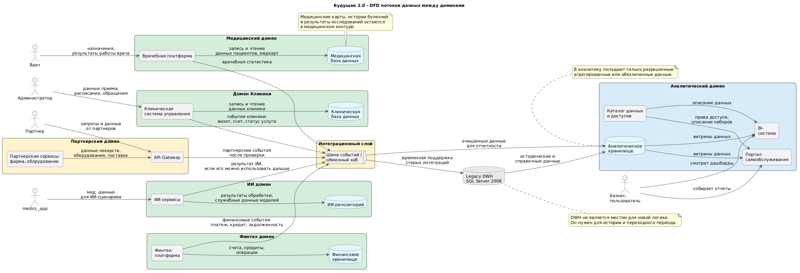

## Задание 2. Разделение системы на домены и моделирование потоков данных для поддержки ключевых бизнес-сценариев

## Схема потоков информации

Диаграмма потоков данных (DFD): 

Исходный код диаграммы: [data-flow-diagram.puml](dfd.puml).

## Принцип декомпозиции системы на домены

В существующей архитектуре большинство компонентов замыкается на единое хранилище данных. Для стартапа это было удобным решением, но в масштабах «Будущего 2.0» такой подход уже создаёт препятствия: клиники, финтех-сервисы, ИИ-решения и перспективные партнёрские направления развиваются в разном темпе и предъявляют неодинаковые требования к обработке информации.

В связи с этим я предлагаю разбить систему на ряд самостоятельных доменов.

| Домен           | Зона ответственности | Типы хранимых данных |
|-----------------|  | --- |
| Клиники         | Управление работой медучреждений, ведение приёмов, расписания и лечебных процессов | Информация о пациентах, записи на приёмы, перечень услуг, врачебная документация |
| Медики          | Работа с медкартами | Информация о медицинских картах, болезнях и пациентах |
| ИИ              | Интеллектуальные помощники для врачей и обработка клинических массивов | Обучающие выборки, выходные данные алгоритмов |
| Финтех          | Банковские и финансовые сервисы | Расчётные счета, кредитные договоры, транзакции, платёжная история |
| Аналитика       | Построение отчётов, витрины данных, самообслуживание пользователей | Согласованные витрины, сводные метрики, справочники |
| Партнёры        | Взаимодействие с фармкомпаниями и производителями медицинского оборудования | Справочники лекарств, графики поставок, спецификации оборудования |
| Наследуемое DWH | Хранение исторических архивов и поддержка устаревших интеграций | Немигрированные данные прошлых периодов |

## Схема перемещения данных

| Источник            | Приёмник | Содержимое передачи                                                      |
|---------------------| --- |--------------------------------------------------------------------------|
| Домен Клиники       | Интеграционный слой | Событийные сообщения о визитах, услугах, счетах и изменении статусов     |
| Домен Медиков       | Интеграционный слой | Данные о врачебной статистике                                            |
| Домен Медиков       | Домен ИИ | Клинические сведения, востребованные для ИИ-задач                        |
| Домен ИИ            | Интеграционный слой | Результаты работы моделей, если они могут быть полезны в других контурах |
| Домен Финтех        | Интеграционный слой | Финансовые транзакции: платежи, кредитные операции, задолженность        |
| Партнёры            | API Gateway / интеграционный слой | Сведения о лекарственных препаратах, оборудовании, условиях поставок     |
| Интеграционный слой | Аналитика | Обработанные и структурированные данные для формирования отчётов         |
| Наследуемое DWH     | Аналитика | Исторические архивы и справочные записи                                  |
| Аналитика           | Портал и BI | Готовые витрины данных для отчётных систем                               |

## Критическое требование к медицинской информации

Медицинские карты, истории болезни и клинические исследования категорически не подлежат выгрузке в общее аналитическое хранилище. Эти сведения должны оставаться исключительно в периметре медицинского домена.

Для построения отчётности разрешается применять только те данные, которые допускаются политиками безопасности: к примеру, агрегированная статистика по услугам, показатели загрузки клиник, финансовые и операционные метрики, индикаторы качества сервиса. При необходимости включения медицинских параметров в аналитику они обязательно обезличиваются или сводятся к обобщённым показателям.

## Обоснование выделенных доменных границ

### Клиники

Направление управление клиникой — это ядро бизнеса, со своей спецификой: ведение расписания, запись пациентов, врачебная работа, управление клиническими записями. Этот домен должен иметь возможность эволюционировать самостоятельно, не синхронизируясь с изменениями в финансовом или аналитическом блоках.

### Медики/Врачи

Медицинское направление — Лечебное дело с врачебной тайной и всеми ограничениями по 152 ФЗ.

### Финтех

Финансовые сервисы функционируют в условиях банковского регулирования и оперируют чувствительными расчётными данными. Здесь действуют иные риски и более жёсткие требования к защите. Поэтому финансовую логику целесообразно изолировать от медицинской экосистемы и не размещать новые разработки в старом DWH.

### ИИ

Интеллектуальные сервисы взаимодействуют с клинической информацией и часто нуждаются в специализированных хранилищах, отдельных вычислительных мощностях и строгом разграничении доступа. Их развитие лучше вести обособленно, чтобы эксперименты с алгоритмами не сказывались на стабильности клиник и отчётных систем.

### Аналитика

Аналитический контур выделен самостоятельным блоком, чтобы снять нагрузку с операционных сред и наследуемого хранилища. В рамках этого домена развёртываются аналитическое хранилище, портал самообслуживания, BI-платформа и каталог доступных данных.

### Партнёры

Фармацевтические вендоры и поставщики оборудования привлекаются как внешние стороны. Предоставлять им прямой доступ к внутренним базам недопустимо. Следовательно, подключение организуется исключительно через API-шлюз и интеграционный слой.

## Практическая ценность для бизнеса

| Бизнес-сценарий | Как способствует декомпозиция |
| --- | --- |
| Ускорение подготовки отчётов | Аналитика получает подготовленные данные напрямую из доменов, минуя перегруженное DWH. |
| Независимое развитие финтеха | Финансовая команда вносит изменения в свои сервисы без вмешательства в медицинское хранилище. |
| Свободное развитие ИИ | ИИ-специалисты работают в изолированной среде, не создавая помех операционной деятельности клиник. |
| Быстрое подключение новых партнёров | Интеграция выполняется через API и событийную модель, без ручной настройки доступа к внутренним системам. |
| Ослабление привязки к DWH | Новая функциональность разрабатывается внутри доменов, а старое хранилище выполняет лишь архивную и переходную роль. |
| Повышение защищённости данных | Медицинская и финансовая информация разнесены по разным контурам, что позволяет настроить более точные политики доступа. |

## Резюмирующий вывод

Ключевая идея предлагаемого решения — переход от монолитного DWH как единого центра бизнес-логики к распределённой модели. Каждый домен самостоятельно управляет своими информационными активами и публикует вовне только те события или подготовленные срезы, которые действительно необходимы другим системам. Аналитическая функция строится как отдельный слой, потребляющий исключительно санкционированные наборы данных.