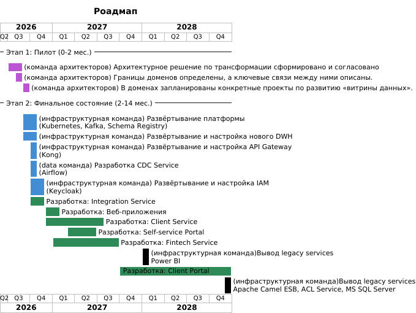

## Задание 3. Разработка технологического радара и роадмапа изменений для поддержки бизнес-целей компании

### Технологический радар

|Кольцо|Архитектурные паттерны| Платформы                                                                 | Инструменты                                                                                           | Языки и фреймворки              |
|------|----------------------|---------------------------------------------------------------------------|-------------------------------------------------------------------------------------------------------|---------------------------------|
|Adopt|DDD, Event-Driven-Architecture, IaC, Anti Corruption Layer, Cloud Native| Apache Airflow, Apache Kafka, Keycloak, Greenplum, PostgreSQL, Kubernetes | OpenTofu, Kafka Connect, Confluent Schema Registry, Prometheus, Grafana, OpenTelemetry, Grafana Tempo | Go, Java, Kotlin, Python, React |
|Trial|Data Mesh, Self-service BI| Cloud Services, AI/ML Platforms                                           | MinIO, Nessie, Dremio                                                                                 | Rust                            |
|Assess|CQRS|                                                                           | Terraform                                                                                             |                                 |
|Hold|Batch ETL, ESB| MS SQL Server 2008                                                        | ESB(Apache Camel), Powerbuilder, Power BI                                                             | .Net, ASP                       |

### Роадмап 

Roadmap: 

Исходный код диаграммы: [roadmap.puml](roadmap.puml).