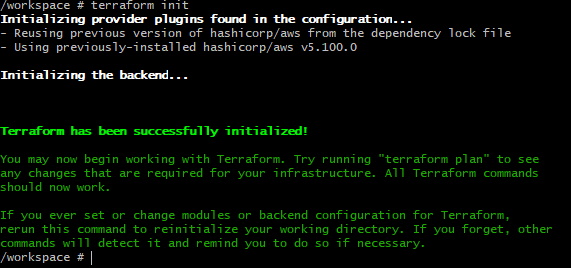
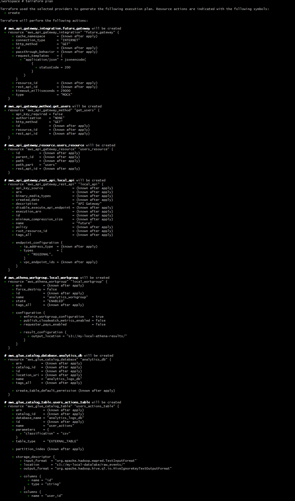
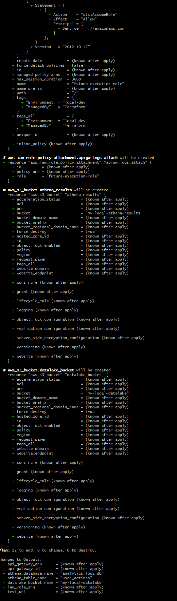
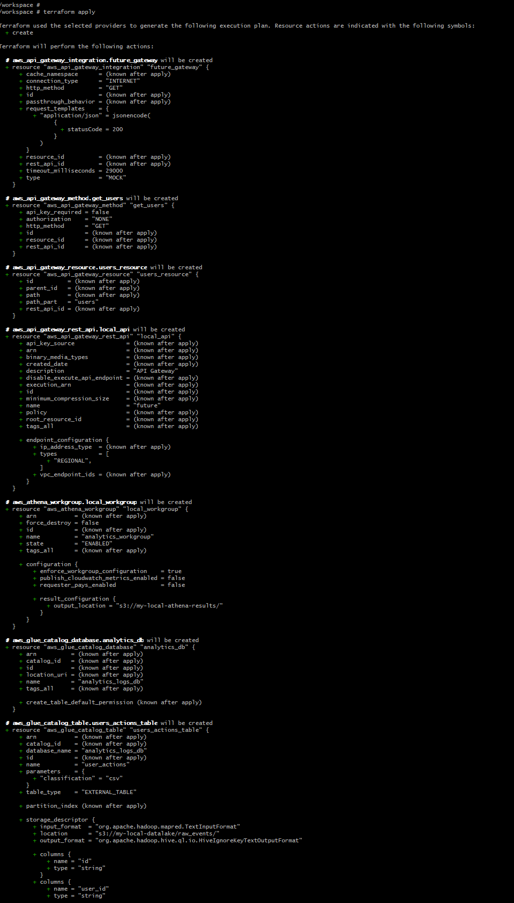
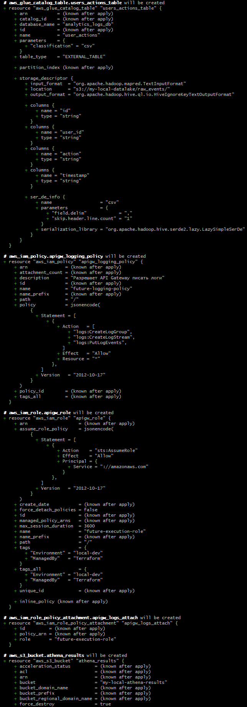
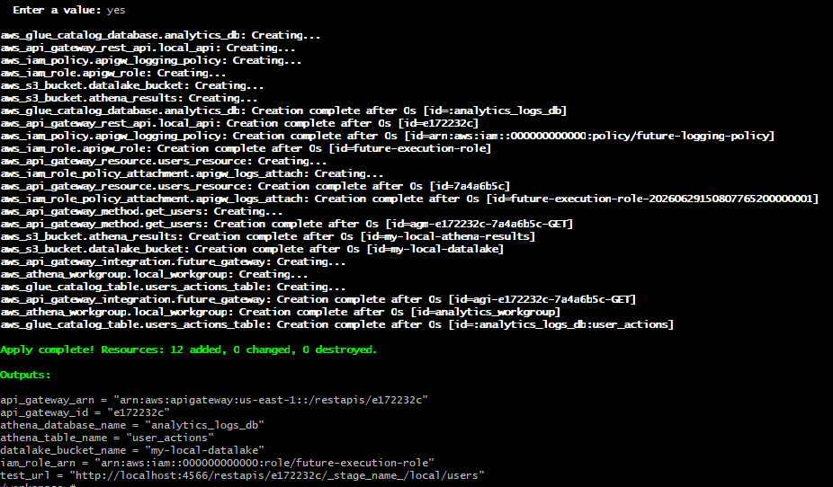

## Задание 4. Проектирование облачной инфраструктуры с применением IaaS и Terraform.

В качестве инструмента для работы с облачной инфраструктурой я выбрал продукт Ministack(ministackorg/ministack).  
Он позволяет бесплатно потренироваться на предмет использования terraform для облачной инфраструктуры.  
Изначально хотел попробовать Localstack, как родное решение от AWS - но наткнулся на ограничения - и продукт теперь совсем не бесплатный, да и другие ограничения тоже не способствуют использованию.

Ministack позволяет добавить IAM, API Gateway, S3, Athena, Glue.  
Этот стек очень хорошо подходит под использованное мною решение, хотя Athena и Glue не описывались в предыдущих заданиях.   

### Terraform-файлы

- [main.tf](configs/main.tf) - основные ресурсы.
- [variables.tf](configs/variables.tf) - переменные.
- [outputs.tf](configs/outputs.tf) - вывод значений после создания.
- [terraform.tfvars](configs/terraform.tfvars) - пример значений переменных.

### Скриншоты работы с terraform:
#### Terraform init
   

#### Terraform plan
  
  

#### Terraform apply
  
  
  
  

